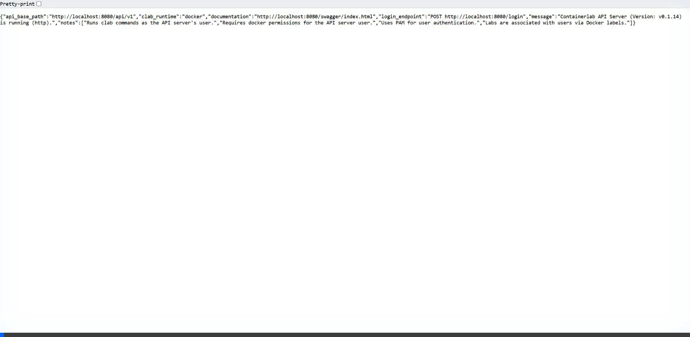
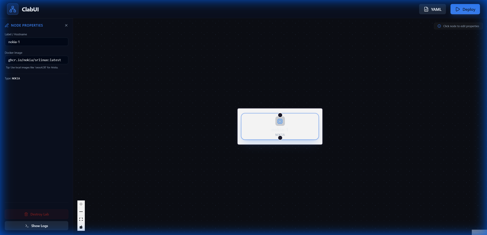

# ClabUI

**ClabUI** is a professional, high-fidelity topology designer for [Containerlab](https://containerlab.dev/). It provides an intuitive, PNETLab-style drag-and-drop interface to build, visualize, and deploy network labs in seconds.



## ✨ Features

- **Nano-Scale Visuals**: Ultra-compact node design for high-density network modeling.
- **Drag & Drop Palette**: Rapidly build topologies by dragging vendor nodes directly onto a fluid canvas.
- **Smart Interface Management**: Automatic, vendor-aware interface naming (e.g., `ethernet-1/X` for Nokia, `ge-0/0/X` for Juniper).
- **Node Property Editor**: Click any node to customize hostnames and specify Docker images (crucial for private/local images like Arista cEOS).
- **Dynamic Lab Management**: Isolation via customizable lab names and real-time conflict resolution tips.
- **Lab Console**: Integrated real-time log viewer with ANSI support and clean table formatting.
- **Secure Remote Access**: Powered by a CORS Relay that handles JWT authentication and command execution on remote hosts.

## 🛠️ Feature Spotlight: Node Properties
Configure your network nodes on the fly. Change hostnames or point to local Docker images to resolve deployment errors instantly.



## 🚀 Getting Started

### 1. Prerequisites
- **Containerlab** installed on your target server.
- **Node.js** (for the UI).
- **Python 3.8+** (for the CORS Relay backend).

### 2. Setup the Relay Backend
The relay allows safe cross-origin communication between the UI and your remote Containerlab instance. It also handles JWT signing for authentication.

```bash
cd backend
pip install fastapi uvicorn requests pyjwt
python main.py
```
*The relay runs on port 8000 by default.*

### 3. Setup the UI Frontend
```bash
cd frontend
npm install
npm run dev
```
*Open [http://localhost:5173](http://localhost:5173) in your browser.*

## 📖 Usage

1. **Configure**: Enter your remote Containerlab API URL and credentials in the sidebar.
2. **Build**: Drag nodes from the **Nodes Palette** and link them by dragging between handles.
3. **Customize**: Click a node to open the **Node Properties** panel and override the Docker image or hostname if needed.
4. **Deploy**: Hit **Deploy** and watch the real-time logs in the **Lab Console**.

## 📄 License

ClabUI is released under the [Apache 2.0 License](LICENSE).
